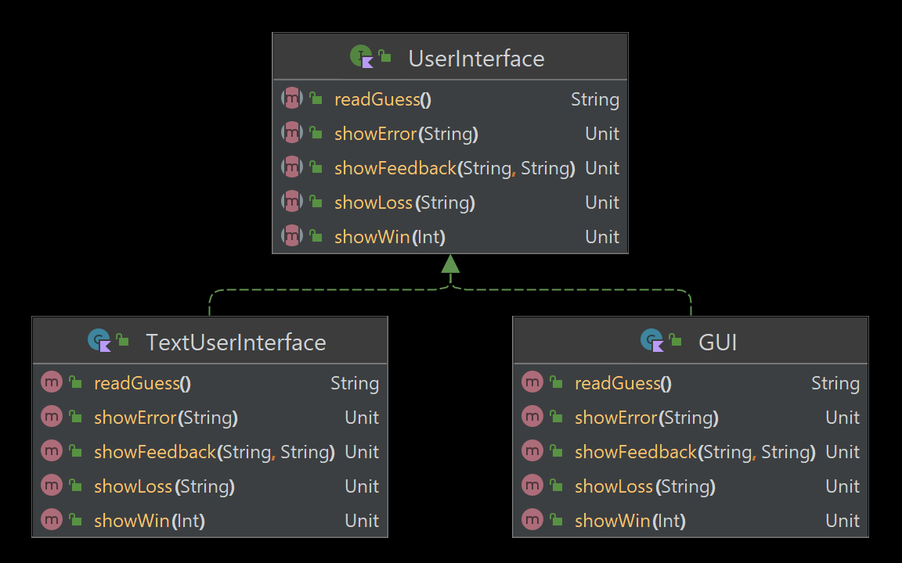
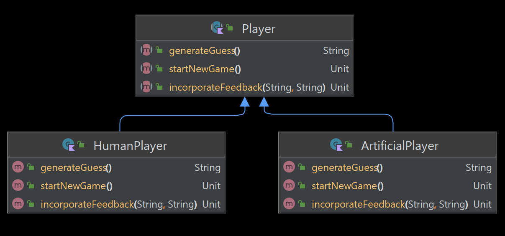

# Homework 10: Wordle Revisited

In this assignment, you will complete an implementation of Wordle that:

* allows repeating letters
* offers a choice between text and graphical user interfaces
* implements an artificial intelligence solver
* uses the real Wordle dictionaries
    * [input-words.txt](../../../data/dictionaries/input-words.txt) (14,855),
      words that are acceptable as guesses
    * [secret-words.txt](../../../data/dictionaries/secret-words.txt) (2,317 words), from which the secret word is
      selected

It is designed to give you practice with interfaces and anonymous functions
created at run-time (similar to what we did in class).

You are strongly advised to read this entire document in preview mode
(showing the pictures) before starting work.

## Setup

First, you should play a game of Wordle to learn or refresh yourself on its
behavior. If you don't want to cross the
[NYT Tech Guild picket line](https://www.theverge.com/2024/11/4/24287600/new-york-times-tech-guild-strike-before-presidential-election),
you can use [WordPlay](https://wordplay.com/) instead of the official
[NYT Wordle](https://www.nytimes.com/games/wordle/index.html).

## Part 1: UserInterface

### Overview


This code has an interface named `UserInterface`, which describes how the user
interacts with the game. You should read the KDoc in
[UserInterface.kt](UserInterface.kt) or generate and view it in a web browser.

You have been provided with the class `GUI`, which provides a complete graphical
implementation of `UserInterface`. You do not need to understand the code in
that file.

## GUI

Play the game with the human player (you) and the graphical user interface
(written by us) by running the task `application > runGuiWithHuman` using
Gradle.

Note that it indicates that a player has won the game by displaying at the top
one of these words, depending on how many guesses were made:

1. Genius
2. Magnificent
3. Impressive
4. Splendid
5. Great
6. Phew

### TextUserInterface

Complete the class [TextUserInterface](TextUserInterface.kt) to create a
textual user interface to the game (similar to the one in Homework 4).
Guidance appears in the source code.

Test it by running the task `application > runTextWithHuman`.

Here are some testing and debugging tips:

* To use the debugger, click on IntelliJ's bug icon after having run it through
  Gradle at least once.
* You can temporarily change `playGame()` so it always uses the same secret word
  (or always prints it at the start of the game).
* You can temporarily change the constant `MAX_TURNS` to give yourself more turns.

### Transcript

Follow these instructions to submit a transcript using the text UI (`runTextWithHuman`).

1. Force the secret word to be "HUSKY".
2. Play the game, where you guess the word on your 6th attempt.
3. Play the game, where you do not guess the word.
4. Paste the transcript showing the two plays where indicated in `Summary.md`.

## Part 2: Player



### Overview

There is a `Player` interface, with two implementations, `HumanPlayer` and
`ArtificialPlayer`. `HumanPlayer` is complete, but you need to implement
`ArtificialPlayer`.

### ArtificialPlayer

Here's an overview of how `ArtificialPlayer` will work:

1. It reads in [input-words.txt](../../../data/dictionaries/input-words.txt),
   which contains all the words permitted as guesses in Wordle.
2. It has a private mutable list `constraints` that holds a list of predicates
   that take a single `String` argument and return a `Boolean` indicating
   whether the word satisfies the constraint.
3. Its first guess is simply the first word in its list of legal words.
4. When it gets a response for its guess, it adds constraints. For example, if
   its guess was `WORLD` and it received the feedback `*+...`, it would add
   these constraints:
    * The letter `W` is the first character of the secret word.
    * The letter `O` is not the second character but is somewhere in the secret
      word.
    * The letter `R` is not in the secret word.
    * The letter `L` is not in the secret word.
    * The letter `D` is not in the secret word.
5. For its next guess, it would choose the first word in its list that
   satisfies all the constraints. You may find the
   [first() method](https://kotlinlang.org/api/latest/jvm/stdlib/kotlin.collections/first.html)
   helpful. See [sample use](https://pl.kotl.in/oM2mzp_fC).

There is a tricky situation you need to watch out for that involves repeated
letters in a guess. Consider these conditions:

```
secret word:  HORSE
guess:        HOHED
match string: **.+.
index:        01234
```

Going character by character, you might:

1. Add a constraint that the first character must be `H`. This is correct.
2. Add a constraint that the second character must be `O`. This is correct.
3. Add a constraint that `H` does not appear. This is **wrong**. The `.` at
   position 2 in the match string means that there is not a *second* `H`.

I advise you not to try to be too clever. It's fine to not generate a constraint
for indices where both (1) the match string has a `.` and (2) the guess has a
letter that appears elsewhere in the guess.

### Testing

You can test your code with either of these tasks:

* `runGuiWithAI`
* `runTextWithAI`

### Tip

You can optionally improve the performance of the AI by manually reordering
words in [input-words.txt](../../../data/dictionaries/input-words.txt) so words
with the most common letters are at the start of the file. I put my favorite
start word ("ADIEU") at the top of the file. Feel free to place yours at the
top instead.

### Transcript

Follow these instructions to submit a transcript:

1. Force the secret word to be "HUSKY".
2. Play the game (`runTextWithAI`).
3. Paste the transcript where indicated in `Summary.md`.

Unlike the previous transcript, this will not include prompts.

## Just for Fun

Even though it's not required, I encourage you to try `runGuiWithAI`, which
is fun to watch.
